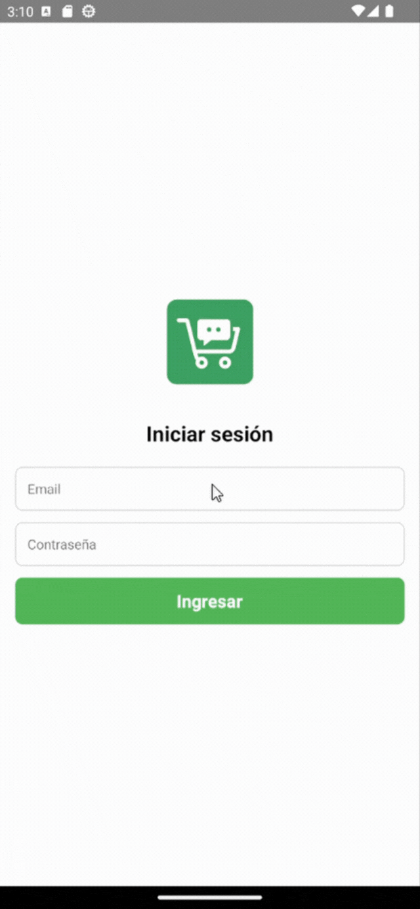
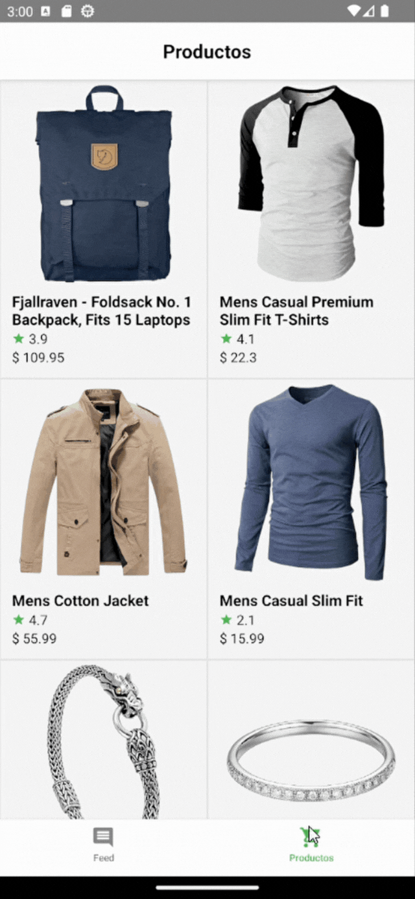

# Challenge Técnico – React Native (Marketplace)

App de marketplace con **login**, **persistencia de sesión**, **tabs** (Feed / Productos) y **checkout simulado** según los criterios del challenge.

## Resumen del flujo
1) **Login** (email/pass hardcodeado) → valida y persiste sesión en AsyncStorage.  
2) **Tabs**:  Utiliza header personalizado con `react-native-safe-area-context` para adaptarse facilmente a todos los dispositivos
   - **Feed**: Lista hardcodeada en assets/feed.json. Manejo de error y estado de carga
   - **Productos**: Lista consumida de la api `FakeStoreAPI`. Manejo de error y estado de carga
   - **Checkout**: Presentantion tipo modal para confirmar la compra. Opción de cambiar el metodo de pago (ambos hardcodeados en asset/payment_methods.json). Luego de confirma abre modal de confirmacion y vuelve a Feed.
3) **Cerrar sesión**: limpia AsyncStorage y vuelve al login.

---

## Stack elegido
- **React Native bare + TypeScript**  
- **Estado**: React **Context + useReducer**  
- **Navegación**: `@react-navigation/native` + `@react-navigation/stack` + `@react-navigation/bottom-tabs`.  
- **Persistencia de sesión**: `@react-native-async-storage/async-storage`.  
- **Estilos**: `StyleSheet` nativo, `Color scheme` para cambiar colores segun modo del dispositivo light o dark.
- **Íconos**: `react-native-vector-icons` (MaterialCommunityIcons).  

---

## Arquitectura y decisiones
**Auth**  
- `src/context/AuthContext.tsx`: maneja `{status, user}` con `useReducer`.  
- Acciones: `RESTORE` (boot desde AsyncStorage), `SIGN_IN`, `SIGN_OUT`, `RESTORE`.  
- `signIn` guarda `STORAGE_KEYS.user`; `signOut` borra storage.  
- `isAuthenticated = status === 'auth'`.

**Navegación**  
- `src/navigation/AppNavigator.tsx`:  
  - **Stack**: `Login` | `Main` (Tabs).  
  - **Tabs**: `Feed` | `Productos`.  
  - Tanto en login como en logout exitoso se resetea el navigation para evitar volver a la pantalla anterior con gestos `navigation.reset({ index: 0, routes: [{ name: 'Stack' }] })`.

**Datos**  

**Formato regional (es-AR)**  
- Moneda ARS, fechas `dd/MM/yyyy HH:mm`.  

---

## Estructura de carpetas
```
android/
ios/
src/
  assets/                # imágenes / mocks 
  components/            # Componentes reutilizables
  constants/             # claves y constantes (auth, colores, etc.)
  context/               # Estados globales de la App
  navigation/            # AppNavigator (Stack + Tabs)
  screens/               # Componentes principales de las vistas
  services/              # Servicios API
  types/                 # tipos typescript (User)
  utils/                 # Funciones comunes
  App.tsx
index.js
```

---

## Decisiones técnicas

- **Context + useReducer**: Implente context ya que el proyecto era relativamente pequeño y resultaba mas sencillo de implementar sobre Redux toolkit

- **Mock**: utilice mock en assets/feed.json para los comentarios debido a que la API JSONPlaceHolder no proporcionaba datos coherentes con el proyecto (body del comment lorem ipsum)

- **FakeStoreAPI**: Por otro lado para los productos los datos de FakeStoreAPI resultaban mas convincentes.

- **StyleSheet**: Elegí StyleSheet nativo sobre styled-components ya que la UI era relativamente sencilla y no justificaba agregar dependencias adicionales.

---

## Flujos principales

## Login Flow


**Feed**


**Productos**


**Checkout**


---

## Credenciales de demo para el challenge
- **email**: `test@it.rock`  
- **password**: `123456`  

> Se validan localmente y se persisten en `AsyncStorage` bajo `STORAGE_KEYS.user`.

---

## Setup y ejecución (npm)
> Requisitos previos: Node (v20.19.4 utilizada), JDK 17+, Android SDK.

1) **Instalar dependencias**
```bash
npm install
```
2) **iOS (solo macOS)**
```bash
npx pod-install
```
3) **Correr en Android**
```bash
npx react-native run-android
```
4) **Correr en iOS**
```bash
npx react-native run-ios
```


---

## Criterios de aceptación

1) **Login**
- [x] Ingreso con credenciales válidas permite navegar a Tabs.
- [x] Persistencia: reabrir la app mantiene sesión (va directo a Feed).
- [x] Cerrar sesión: limpia AsyncStorage y vuelve al login.

2) **Navegación**

- [x] Bottom Tabs con Feed (default) y Productos.
- [x] Back/gestos funcionan sin loops extraños.

3) **Feed**
- [x] Lista renderiza avatar o iniciales, nombre, fecha‑hora, comentario.
- [x] Cubre estados: loading, vacío, error.
- [x] Origen mock local (assets/feed.json) .
- [x] Pull‑to‑refresh y paginación.

4)  Productos
- [x] Lista con imagen, título y precio.
- [x] Tap → checkout → feedback visual (modal).
- [x] Cubre estados: loading, vacío, error.

6) Cross‑platform
- [x] Proyecto corre en Android e iOS con instrucciones claras para build/run
en README.